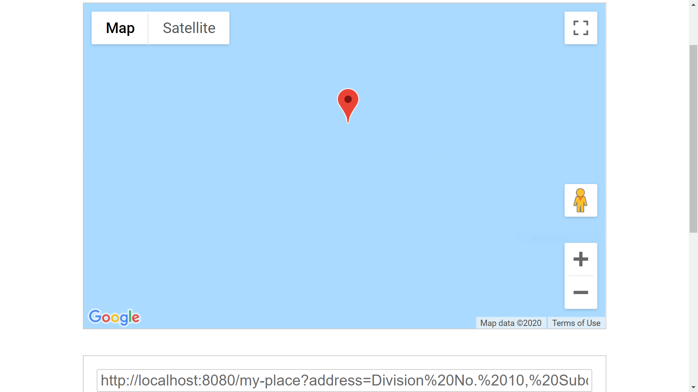

URL:https://gallant-almeida-a6a1da.netlify.app/

### FIND MY PLACE

This application was built in order to continue to work with Object Oriented Programming with javascript. Using classes to manipulate DOM elements, parsing element data, passing method references, moving DOM elements. Also in using OOP , I made API calls to the google Geo Location javaScript API. I used the Async/Await feature in order to make HTTPS requests. This application was configuring using webpack.

### NOTE: ENV PROCESS WAS NOT USED IN THIS APPLICATION GIVEN THAT IT DOES NOT RUN ON A SERVER. HOWEVER THE NECESSARY SECURITY PROTOCOLS HAVE BEEN ENABLED; IN ORDER TO SECURE THE GOOGLE API KEYS.

### Usage

This application is not intended to be used on a regular basis, the main concept behind it is to get a deeper understanding in working with classes and object oriented programming with javascript.

Once you load the page:

1. Click on GET CURRENT LOCATION BUTTON.
2. If you accept the location request, a map will render to the DOM. In this map you can view your current location.
3. On the top of the page above the SHARE MY PLACE button, a URL will render.
4. If you click on the SHARE MY PLACE button, the URL will be copied to your clipboard, and then you can share you location with anyone you choose.
5. If you do not wish to share your location; you can enter a street address, in the address box.
6. Once you enter this address the same functionality as before mentioned will be available.

### To download:

Form the browser just click on the clone or download button and in the repo page and download the zip file.

From the command line: git clone https://github.com/omarvegaabreu/findplace.git

### Technologies used

-ES6 Javascript
-Webpack
-ESlint
-HTML
-CSS
